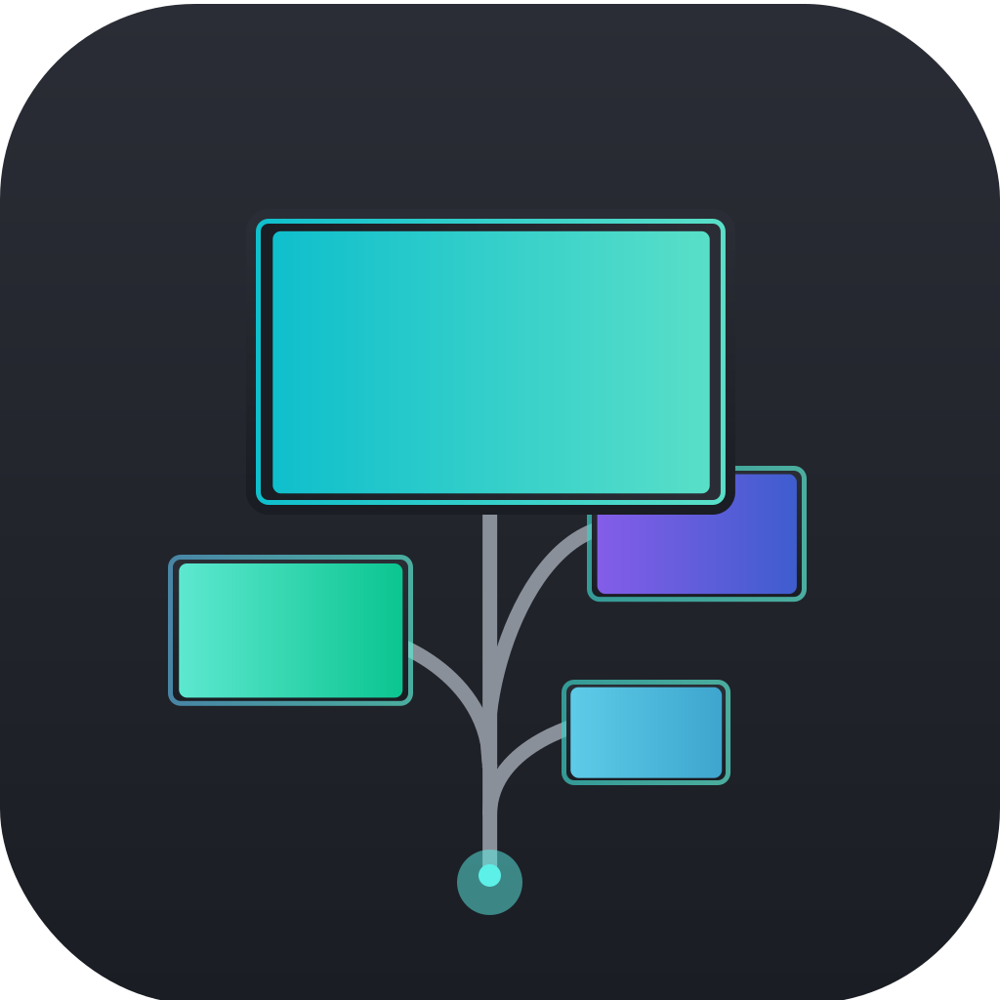
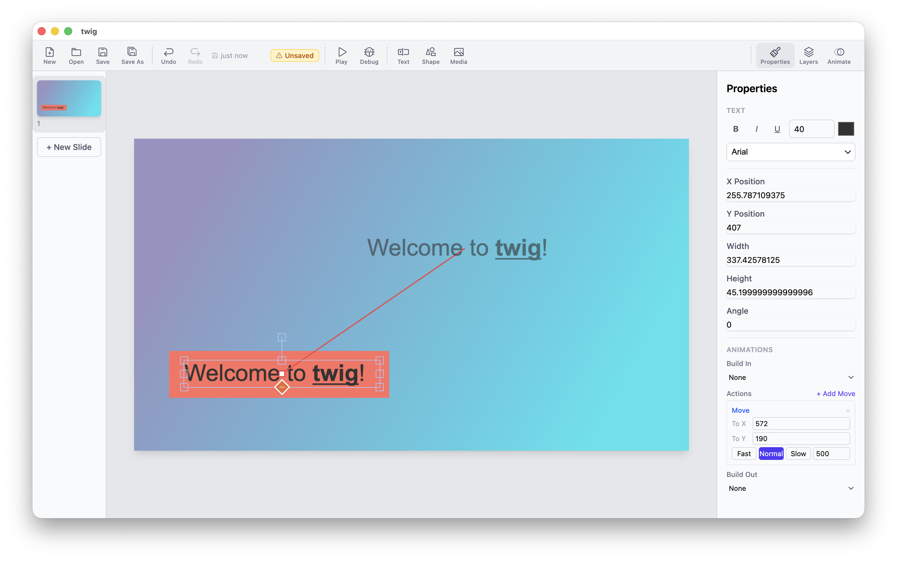
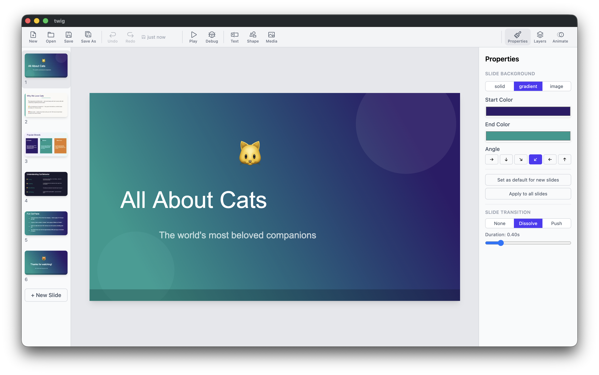

<div align="center">
<br/><br/>

**twig** &nbsp;·&nbsp; a presentation editor that looks the same everywhere

[](https://github.com/boomzero/twig/releases)
[](LICENSE)
[](#installation)

<br/>

<a href="https://apps.apple.com/us/app/twig-presentation-editor/id6761291348">
  
</a>

</div>

---

Most presentation tools silently shift your layouts when you move between platforms — a font renders a touch wider on Windows, a gradient looks different on Linux, and your carefully crafted slide is broken on the day you need it.

twig is built around one goal: **what you see on your machine is what your audience sees on theirs.** Near pixel-identical rendering across platforms, consistent font metrics, reproducible layouts. Make it once, present it anywhere.

Presentations are stored as `.tb` files — plain SQLite databases. No cloud required, no subscriptions, no lock-in.

---

## Demos




## Status

twig is in active development. It handles the essentials — editing, transitions, animations, custom fonts, backgrounds — and works well for day-to-day use.

On the roadmap: templates, element grouping, alignment guides, and more transitions and animation types.

---

## Installation

Grab the latest build from [Releases](https://github.com/boomzero/twig/releases).

| Platform | File |
|----------|------|
| macOS | `.dmg` or Mac App Store |
| Windows | `.exe` / `.msi` |
| Linux | `.AppImage` / `.deb` |

---

## Building from source

Requires Node.js 20+.

```bash
git clone https://github.com/boomzero/twig.git
cd twig
npm install
npm run dev          # development with hot reload
npm run build        # production build
npm run build:mac    # local macOS package signed with Apple Development
npm run build:mac:release # release macOS package signed + notarized
npm run build:win    # package for Windows
npm run build:linux  # package for Linux
```

---

## Generating presentations with AI

Because `.tb` files are plain SQLite databases with a simple, well-defined schema, AI agents can generate complete presentations directly — no GUI required.

The full format is documented in [TWIG_SPEC.md](TWIG_SPEC.md), including all element types, coordinate system, JSON column formats, animation structure, and a ready-to-run Python example. Point an AI at that file and ask it to produce a `.tb` for you.

---

## Contributing

PRs and issues welcome. See [CLAUDE.md](CLAUDE.md) for architecture notes and development patterns.

---

## License

GPL v3 — see [LICENSE](LICENSE). © [boomzero](https://github.com/boomzero)
